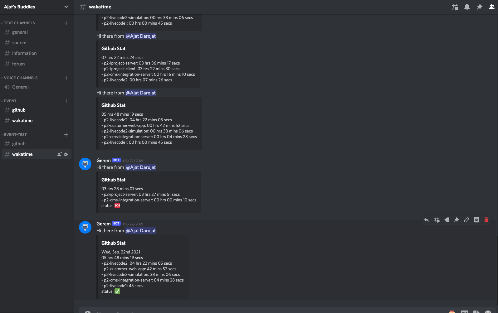
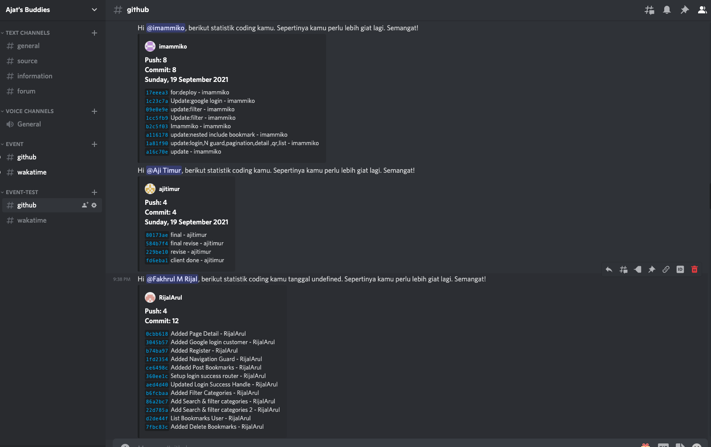

# CTAP-reminder APP

CTAP-reminder is a scheduling app to remind bootcamp students of their coding time and git push and commit. Integrated with wakatime, github and discord api. If their coding time or git push and commit is below the set standard, they will get a notification via the discord channel as a reminder along with information regarding their coding time and git push and commit. This application runs according to a predetermined time can be daily, weekly or tailored to your needs.

&nbsp;

## Tech Stack used to build this app :

- NodeJS
- ExpressJS
- MongoDB
- Cron is a tool that allows you to execute something on a schedule.
- bull is Redis-based queue for Node

&nbsp;

## Remainer Preview :

### Coding time reminder

### Git commit and push reminder

