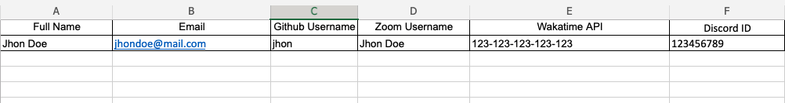

# CTAP-reminder APP
CTAP-reminder is a scheduling app to remind bootcamp students of their coding time and git push and commit. Integrated with wakatime, github and discord api. If their coding time or git push and commit is below the set standard, they will get a notification via the discord channel as a reminder along with information regarding their coding time and git push and commit. This application runs according to a predetermined time can be daily, weekly or tailored to your needs.

&nbsp;

Tech Stack used to build this app :
* Node JS
* Express JS framework
* MongoDB
* cron for sceduling
* bull for queue

&nbsp;

## Endpoints
### GET /students

> Get all students

_Query Params_
```
githubUsername: "foo,bar"
```

_Request Header_
```
not needed
```

_Request Body_
```
not needed
```

_Response (200)_
```
[
  {
    "github": {
        "username": <string>
    },
    "zoom": {
        "nickname": <string>
    },
    "wakatime": {
        "api": <string>
    },
    "discord": {
        "id": <string>
    },
    "_id": <ObjectId>,
    "name": <string>,
    "email": <string>,
    "isActive": <boolean>,
    "isDelete": <string>,
    "createdAt": <datetime>,
    "updatedAt": <datetime>,
    "__v": <number>
  },
  ...
]
```

---
### POST /students/uploadExcel

> Create multiple students by excel file

_Request Header_
```
not needed
```

_Request Body form-data_

```
student: path/to/file.xlsx
```

_Response (201)_
```
```

---
### POST /students/insertOne

> Create new student

_Request Header_
```
not needed
```

_Request Body_
```
{
  "name": <string>,
  "email": <string>,
  "github": {
    "username": <string>
  },
  "zoom": {
    "nickname": <string>
  },
  "wakatime": {
    "api": <string>
  },
  "discord": {
    "id": <string>
  }
}
```

_Response (201 - Created)_
```
```

---
### POST /students/insertMany

> Create multiple students

_Request Header_
```
not needed
```

_Request Body_
```
[
  {
    "name": <string>,
    "email": <string>,
    "github": {
      "username": <string>
    },
    "zoom": {
      "nickname": <string>
    },
    "wakatime": {
      "api": <string>
    },
    "discord": {
      "id": <string>
    }
  },
  ...
]
```

_Response (201 - Created)_
```
```


---
### POST /students/updateMany

> Update multiple students

_Request Header_
```
not needed
```

_Request Body_
```
{
  "filter": {
    "github.username": [<string>, <string>]
  },
  "payload": {
    "isActive": <boolean>
  }
}
```

_Response (200 - OK)_
```
```


---
### GET /wakatime

> Get an coding time base on date and github username provided

_Query Params_
```
username: foo
startDate: 2021-09-20
endDate: 2021-09-21
```

_Request Header_
```
not needed
```

_Request Body_
```
not needed
```

_Response (200 - OK)_
```
{
  "username": <string>,
  "startDate": <string>,
  "endDate": <string>,
  "cumulative": {
    "hours": <number>,
    "minutes": <number>,
    "text": <string>
  },
  "projectsPerDayText": [<string>, <string>],
  "projectsText": <string>,
  "projects": [
    {
        "name": <string>,
        "hours": <number>,
        "minutes": <number>,
        "seconds": <number>,
        "total_seconds": <number>,
        "text": <string>
    },
    ...
  ]
}
```

---
### GET /github/count

> Get git commit and push data

_Query Params_
```
orgName: foo
repos: foo,bar
username: 2021-09-21
```

_Request Header_
```
not needed
```

_Request Body_
```
not needed
```

_Response (200 - OK)_
```
{
  "orgName": <string>,
  "repos": <string>,
  "username": <string>,
  "push": <number>,
  "commit": <number>,
  "commitMessages": [<string>, <string>],
  "commitMessagesAndDate": [<string>, <string>],
  "commitMessageText": <string>
}
```